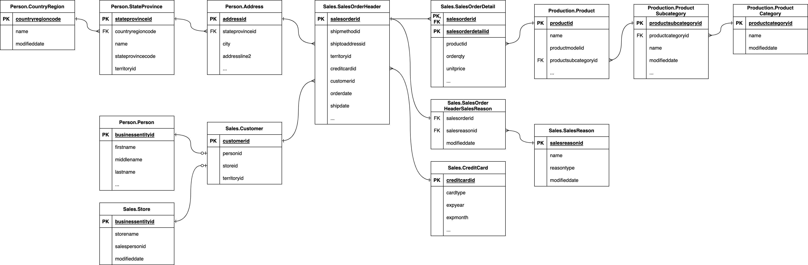

# dbt-kimball

This repository contains the code for a dbt tutorial about Kimball dimensional data modeling. Check out the original tutorial here: [orginial tutorial by dbt](https://docs.getdbt.com/blog/kimball-dimensional-model). Some text passages are directly copied from the original post other where added to faciliate the tutorial. However, I recommend reading first the original articel before starting here.

## Project Setup

### Setup environemnt

I use pipenv for my enviornment management. If you choose another tool get the dependecies from the pipfile.

- Open a terminal in the project root. Execute ```pipenv install```

I use postgres with docker-compose. You can also deploy it differently if you want to.

- Open a terminal in the project root. Execute ```docker-compose up --build```

### Setup dbt

- To install depedencies navigate to the adventureworks folder and execute ```dbt deps``` inside of your virtual enviornment shell.

> You can access the shell with ```pipenv shell```. If this not works because of windows run ```pipenv run dbt deps```.

- To seed the navigate to the adventureworks folder and execute ```dbt seed --target postgres``` inside of your virtual enviornment shell.

> You can access the shell with ```pipenv shell```. If this not works because of windows run ```pipenv run dbt seed --target postgres```.

- Check if the data is present. By opening a shell in the docker container with following command ```docker exec -it <container name> /bin/bash```.
- Login with the postgres cli  ```psql -U postgres```.
- With this command  ```\l``` you can list the databases.
- With this command  ```\c adventureworks``` you can connect to a databases.
- With this command  ```\dn``` you can list the available database schemas and their owners.
- With this command  ```\dt dbo_date.*``` you can list the available tables in a schema.
- You can for example select all date with ```SELECT * FROM dbo_date.date;```.

> You can use this command to get the container name ```docker ps```.
> You can of course also deploy pgAdmin to do the exporation. Just uncomment the secion in the docker-compose.yaml and rerun ```docker-compose up --build```. To connect to the sever add as host name, user and password "postgres".

## SQLFluff Intro

SQLFluff is an open-source SQL linter and formatter that ensures SQL code adheres to specified style guides and best practices. It detects syntax errors, formatting issues, and coding style violations, making SQL code more readable and maintainable. SQLFluff supports various SQL dialects, is highly configurable, and integrates with development environments and CI/CD pipelines. It helps improve code quality, reduces errors, and standardizes SQL code across teams.

## dbt Overview

dbt (data build tool) is an open-source tool for transforming data in a data warehouse. It allows users to write modular SQL queries, test them, and deploy transformations efficiently. dbt integrates with version control, provides testing tools, generates documentation, and supports CI/CD pipelines. It helps convert raw data into structured formats, ensures data quality, and facilitates team collaboration.

### dbt project

Every dbt project needs a dbt_project.yml file — this is how dbt knows a directory is a dbt project. It also contains important information that tells dbt how to operate your project.

- dbt uses YAML in a few different places. If you're new to YAML, it would be worth learning how arrays, dictionaries, and strings are represented.
- By default, dbt looks for the dbt_project.yml in your current working directory and its parents, but you can set a different directory using the --project-dir flag or the DBT_PROJECT_DIR environment variable.

>Your dbt_project.yml should be correctly set up if you did not change anything from the environemnt set up explained above.

### dbt profile

If you're using dbt Core, you'll need a profiles.yml file that contains the connection details for your data platform. When you run dbt Core from the command line, it reads your dbt_project.yml file to find the profile name, and then looks for a profile with the same name in your profiles.yml file. This profile contains all the information dbt needs to connect to your data platform.

>Your profile.yml should be correctly set up if you did not change anything from the environemnt set up explained above.

### dbt package

Package dependencies allow you to add source code from someone else's dbt project into your own, like a library:

- If you only use packages like those from the dbt Hub, remain with packages.yml.
- Use packages.yml when you want to download dbt packages, such as dbt projects, into your root or parent dbt project.
- Use packages.yml to include packages, including private packages, in your project's dependencies. If you have private packages that you need to reference, packages.yml is the way to go.
- packages.yml supports Jinja rendering for historical reasons, allowing dynamic configurations. This can be useful if you need to insert values, like a Git token method from an environment variable, into your package specifications.

>Your package.yml should be correctly set up if you did not change anything from the environemnt set up explained above.

## Task from the original tutorial

Upon speaking with the CEO of AdventureWorks, you learn the following information:

AdventureWorks manufactures bicycles and sells them to consumers (B2C) and businesses (B2B). The bicycles are shipped to customers from all around the world. As the CEO of the business, I would like to know how much revenue we have generated for the year ending 2011, broken down by:

- Product category and subcategory
- Customer Order status
- Shipping country, state, and city

Based on the information provided by the business user, you have identified that the business process in question is the Sales process. In the next part, you are going to design a dimensional model for the Sales process.



## Kimbal Intro

### Fact Table

Fact tables are database tables that represent a business process in the real world. Each record in the fact table represents a business event such as a:

- Item sale,
- Website click,
- Production work order

### Dimension Table

Dimension tables are used to represent contextual or descriptive information for a business process event. Examples of dimensions include:

- Customer details: Who is the customer for a particular order number?
- Website click location details: Which button is the user clicking on?
- Product details: What are the details of the product that was added to the cart?

### Dimensonal Model Process

1. Identify the Business Process
Objective: Understand the core business processes that need to be analyzed.
    - Interview stakeholders to identify key business processes.

    **SOLUTION:**
    - Sales process

    > This as already been done. It is provided by the tutorial text.

2. Explore Database Tables
Objective: Identify the database table which contain the needed information.
    - Based on the text indentify which information is stored in which tables.
    - Examples of tables: SalesOrderHeader stores oder status

    **SOLUTION:**
    - The text mentions:
        - Product category and subcatory: We will need the Production.Product, Production.ProductSubcateogry and Production.ProductCategory, Sales.SalesOrderDetail
        - Customer: We will need the Sales.Customer, Person.Person, Sales.Store.
        - Order status: We will need Sales.SalesOrderHeader
        - Shipping country, data and city: We will need Person.Address, Person.StateProvince, Person.CountryRegion, Sales.SalesOrderHeader
        - Calcuate the revenue: Sales.SalesOrderDetail

3. Declare the Grain
Objective: Define the level of detail in the data warehouse.
    - Determine the lowest level of detail required for each process.
    - Examples of grain: A single sales transaction, an inventory snapshot at the end of the day.

    **SOLUTION:**
    - We could choose the grain to be order however orders are a aggreagte of different products. Hence, the most atomic grain would be on product level per order. We choose order detail as our grain.

4. Identify Dimensions
Objective: Identify the descriptive data that will provide context to the business process.
    - Identify attributes that describe the facts (e.g., Date, Product, Customer).
    - Interview business users to understand what descriptive information is necessary.
    - Examples of dimensions: Time, Product, Customer, Location.

    **SOLUTION:**
    - Based on the provided text we will need following dimension:
        - DimProduct -> Slice by category
        - DimCostumer -> Slice by customer number
        - DimAddress -> Slice by country, state, city
        - DimOrder -> Slice by order status
        - DimDate -> Slice revnue by year, month, day

5. Identify Facts
Objective: Define the numeric measurements that result from a business process.
    - Identify the key performance indicators (KPIs) or metrics.
    - Examples of facts: Sales amount, Number of units sold, Order quantity.

    **SOLUTION:**
    - The KPI is revenue for each product and in total.

6. Design the Dimensional Model
Objective: Structure the model into fact and dimension tables.
    - Create star schema diagram.
    - Ensure each dimension is connected to the fact table.
    - Fact tables should have foreign keys referencing dimension tables.
    - Dimension tables should include surrogate keys.

    **SOLUTION:**
    

7. Create dbt models for Dimension Table
Objective: Define a dbt model for each dimension table.
    - Create tables with surrogate keys and appropriate attributes.

    **SOLUTION:**
    - See SQL files in this repo under models/marts/dim_*.sql

8. Create a dbt model for the Fact Table
Objective: Define a dbt model for the fact table.
    - Create tables with surrogate keys and appropriate attributes.

     **SOLUTION:**
    - See SQL files in this repo under models/marts/fct_sales.sql
